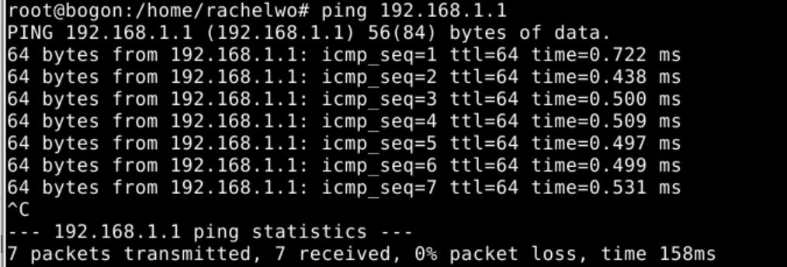
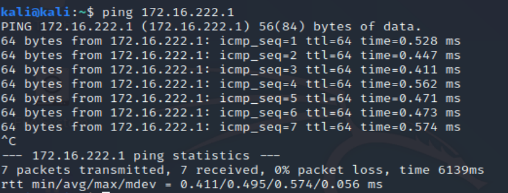

# 防火墙  
## 实验环境  
构建如下的网络拓扑图  
  
其中  
* host-gw 指的是该局域网的网关，已经配置为 NAT 方式，局域网内的主机 host-2 可以正常无障碍访问互联网；
* dns-svr 指的是该局域网中的 DNS 解析服务器，可以正常提供域名解析服务；
* 交换机没有设置 VLAN，所有端口正常工作；
* host-2上配置了 iptables规则；
* host-1上配置了默认网关指向 IP 地址：172.16.18.1，域名解析服务器配置为 IP：192.168.1.1
* host-3上配置了默认网关指向 IP 地址：172.16.18.1，域名解析服务器配置为 IP：192.168.1.1  
## 先行知识  
### **iptables**  
* 架构  
   

1. Filter表 
Filter表示iptables的默认表，因此如果你没有自定义表，那么就默认使用filter表，它具有以下三种内建链：
    * INPUT链 – 处理来自外部的数据。
    * OUTPUT链 – 处理向外发送的数据。
    * FORWARD链 – 将数据转发到本机的其他网卡设备上。  

2. NAT表
NAT表有三种内建链：
    * PREROUTING链 – 处理刚到达本机并在路由转发前的数据包。它会转换数据包中的目标IP地址（destination ip address），通常用于DNAT(destination NAT)。
    * POSTROUTING链 – 处理即将离开本机的数据包。它会转换数据包中的源IP地址（source ip address），通常用于SNAT（source NAT）。
    * OUTPUT链 – 处理本机产生的数据包。  

3. Mangle表
Mangle表用于指定如何处理数据包。它能改变TCP头中的QoS位。Mangle表具有5个内建链：
    * PREROUTING
    * OUTPUT
    * FORWARD
    * INPUT
    * POSTROUTING  

4. Raw表
Raw表用于处理异常，它具有2个内建链：
    * PREROUTING chain
    * OUTPUT chain  
* 规则

  * 格式：`iptables [-t 表] 命令 匹配 动作`
  
  * 命令
  
    | 命令                      | 说明                               |
    | :------------------------ | :--------------------------------- |
    | -P或--policy <链名>       | 定义默认策略                       |
    | -L或--list <链名>         | 查看iptables规则列表               |
    | -A或--append <链名>       | 在规则列表的最后增加1条规则        |
    | -I或--insert <链名>       | 在指定的位置插入1条规则            |
    | -D或--delete <链名>       | 从规则列表中删除1条规则            |
    | -R或--replace <链名>      | 替换规则列表中的某条规则           |
    | -F或--flush <链名>        | 删除规则列表中所有规则             |
    | -Z或--zero <链名>         | 将表中数据包计数器和流量计数器归零 |
    | -X或--delete-chain <链名> | 删除空的规则列表                   |
    | -N或--new-chain <链名>    | 新建规则列表                         |  
  * 匹配
  
    | 匹配                | 说明                                                         |
    | :------------------ | :----------------------------------------------------------- |
    | -i<网络接口名>      | 指定数据包从哪个网络接口进入，如ppp0、eth0和eth1等           |
    | -o<网络接口名>      | 指定数据包从哪块网络接口输出，如ppp0、eth0和eth1等           |
    | -p<协议类型>        | 指定数据包匹配的协议，如TCP、UDP和ICMP等，默认为all          |
    | -s<源地址或子网>    | 指定数据包匹配的源地址                                       |
    | --sport <源端口号>  | 指定数据包匹配的源端口号，可以使用“起始端口号:结束端口号”的格式指定一个范围的端口 |
    | -d<目标地址或子网>  | 指定数据包匹配的目标地址                                     |
    | --dport<目标端口号> | 指定数据包匹配的目标端口号，可以使用“起始端口号:结束端口号”的格式指定一个范围的端口 |
    | -j                  | 决定当与规则匹配时如何处理数据包                             |
    | -m state            | 启用状态匹配模块                                             |
    | -–tcp-flags         | (**针对-p tcp**)可以指定由逗号分隔的多个参数，有效值可以是：SYN, ACK, FIN, RST, URG, PSH |
    | –-state             | 状态匹配模块的参数。NEW、ESTABLISHED、RELATED                |  
 * 动作
  
    | 动作       | 说明                                                         |
    | :--------- | :----------------------------------------------------------- |
    | **基本**   |                                                              |
    | ACCEPT     | 接受数据包                                                   |
    | DROP       | 丢弃数据包                                                   |
    | QUEUE      | 将数据包移交到用户空间                                       |
    | RETURN     | 停止执行当前链中的后续Rules，并返回到调用链(the calling chain)中 |
    | **拓展**   |                                                              |
    | REDIRECT   | 将数据包重新转向到本机或另一台主机的某个端口，通常用功能实现透明代理或对外开放内网某些服务 |
    | SNAT       | 源地址转换，即改变数据包的源地址                             |
    | DNAT       | 目标地址转换，即改变数据包的目的地址                         |
    | MASQUERADE | IP伪装，即是常说的NAT技术，MASQUERADE只能用于ADSL等拨号上网的IP伪装，也就是主机的IP是由ISP分配动态的；如果主机的IP地址是静态固定的，就要使用SNAT |
    | LOG        | 日志功能，将符合规则的数据包的相关信息记录在日志中，以便管理员的分析和排错 |   
* iptables 进阶使用  
1.limit 限制流量  
    ```-m limit --limit 1500/s #限制最大平均匹配速率  ```  
2.mac 匹配特定的mac地址   
    ```iptables -A INPUT -m mac --mac-source 00:1e:ec:f0:ae:77 -j DROP #阻断特定mac地址对本机的连接```  
3.ttl 匹配符合规则的ttl值数据包  
    ```--ttl -eq|-gt|-lt 数值```
* 保存和恢复iptables规则  
```  
# 导出当前防火墙规则到文件
iptables-save > iptables.rules

# 备份当前规则文件
cp iptables.rules iptables.rules.bak

# 用文本编辑器编辑上一步备份出来的当前 iptables 规则文件的副本 iptables.rules

# 应用编辑后的防火墙规则
# -c  指定在还原 iptables 时候，重置当前的数据包计数器和字节计数器的值为零
iptables-restore < iptables.rules

# 随时可以使用之前备份的 iptables.rules.bak 来重置回最近一次没问题的规则  
```  

## 实验内容  
* 对iptables脚本逐行添加代码解释  
```  
#!/bin/bash

IPT="/sbin/iptables"
# debian普通用户下环境变量中没有/sbin，直接使用iptables会出现command not found
$IPT --flush  
# 删除表中所有规则
$IPT --delete-chain
# 删除空的规则列表
$IPT -P INPUT DROP  
# 给INPUT链定义默认策略：丢包
$IPT -P FORWARD DROP  
# 给FORWARD链定义默认策略：丢包
$IPT -P OUTPUT ACCEPT
# 给OUTPT链定义默认策略：接收数据包
$IPT -N forward_demo  
# 新建forward_demo链  
$IPT -N icmp_demo
# 新建icmp_demo链
$IPT -A INPUT -i lo -j ACCEPT  
# 允许本地回环网卡数据输入
$IPT -A OUTPUT -o lo -j ACCEPT
# 允许本地回环网卡数据输出
$IPT -A INPUT -p tcp ! --syn -m state --state NEW -s 0.0.0.0/0 -j DROP
# 所有TCP会话请求都要包含SYN(all TCP sessions should begin with SYN)
$IPT -A INPUT -m state --state ESTABLISHED,RELATED -j ACCEPT
# 接受状态为ESTABLISHED,RELATED的数据包
$IPT -A INPUT -p icmp -j icmp_demo
# 所有使用icmp协议的数据包的输入都要使用icmp_demo链上的规则处理
$IPT -A icmp_demo -p icmp -i eth0 -j ACCEPT  
# 接受eth0网卡上所有icmp数据包
$IPT -A icmp_demo -j RETURN
# 调用icmp_demo链后返回
$IPT -A FORWARD -j forward_demo
# FORWARD链调用forward_demo链，由forward_demo处理数据转发
$IPT -A forward_demo -j LOG --log-prefix FORWARD_DEMO  
# 把forward_demo上的日志记录到前缀为FORWARD_DEMO的日志文件里。
$IPT -A forward_demo -p tcp --dport 80 -m  string --algo bm --string 'baidu' -j DROP  
# 禁止转发含有baidu的tcp包
$IPT -A forward_demo -p tcp -s 172.16.18.11 -j ACCEPT  
# 可以转发来自host1的tcp包
$IPT -A forward_demo -p tcp -d 172.16.18.11 -j ACCEPT
$IPT -A forward_demo -p udp -s 172.16.18.11 --dport 53 -j ACCEPT  
# 可以转发来自host1的udp包
$IPT -A forward_demo -p udp -s 172.16.18.1  --dport 53 -j ACCEPT  
# 可以转发来自host2的udp包
$IPT -A forward_demo -p udp -s 192.168.1.1  --sport 53 -j ACCEPT  
# 可以转发来自host-gw的udp包
$IPT -A forward_demo -p tcp -s 172.16.18.1 -j ACCEPT  
# 可以转发来自host2的tcp包
$IPT -A forward_demo -s 172.16.18.1 -j RETURN
# 对于来自host2的数据包交给FORWARD链（默认策略是DROP）处理
$IPT -t nat -A POSTROUTING -s 172.16.18.1/24 -o eth0 -j MASQUERADE   
# 对172.16.18.1/24网段的数据包，动态读取eth0的ip做SNAT然后输出
```  
##回答问题  
**1.host-1可以ping通ip: 172.16.18.1吗？**  
* 可以  
> ```$IPT -A icmp_demo -p icmp -i eth0 -j ACCEPT```规定接受输入到eth0网卡上所有的icmp请求  
  

**2.host-1可以ping通ip: 192.168.1.1吗？**  
* 可以 
> icmp请求先到达host2,host2经过源地址转换把这个请求输出给host-gw  

**3.host-1可以ping通域名: www.baidu.com吗？**  
* 能  
> 同第二问   

**4.host-1可以访问：http://www.baidu.com 吗？**   
* 不能  
>```$IPT -A forward_demo -p tcp --dport 80 -m string --algo bm --string 'baidu' -j DROP```，host2禁止转发含有‘baidu’的tcp包，而host1的域名解析服务器是host-gw，必须通过host2转发到host-gw  

**5.host-1可以访问：http://61.135.169.121 吗？** 
* 可以  
> host1发送http请求给host2,host2做源地址转换把请求发送给host-gw,再从host-gw那里收到http response转发给host1  
  

**6.host-3可以ping通ip: 172.16.18.1吗？**
* 可以  
> ```$IPT -A icmp_demo -p icmp -i eth0 -j ACCEPT```规定接受输入到eth0网卡上所有的icmp请求  
  

**7.host-3可以ping通ip: 192.168.1.1吗？**  
* 可以  
>icmp请求先到达host2,host2经过源地址转换把这个请求输出给host-gw  
  

**8.host-3可以访问互联网吗？**   
* 可以  
>   

附：  
## 课内实验    
***实验拓扑图***   
 
***禁止icmp ping***  
```$IPT -A INPUT -p ICMP --icmp-type 8 -s 0.0.0.0/0 -j DROP #禁止icmp ping```  
可以看到增加这条规则之前靶机可以ping通网关，但是添加这条命令之后就无法ping通了  
     
  
可以看到规则被成功添加  

***禁止指定IP访问***    
重置iptables规则为允许所有后，运行以下脚本
```  
#!/bin/bash

# iptables script generated 2011-10-13
# http://www.mista.nu/iptables

IPT="/sbin/iptables"

# Flush old rules, old custom tables
$IPT --flush
$IPT --delete-chain

# Set default policies for all three default chains
$IPT -P INPUT DROP
$IPT -P FORWARD DROP
$IPT -P OUTPUT ACCEPT

# Enable free use of loopback interfaces
$IPT -A INPUT -i lo -j ACCEPT
$IPT -A OUTPUT -o lo -j ACCEPT

# All TCP sessions should begin with SYN
$IPT -A INPUT -p tcp ! --syn -m state --state NEW -s 0.0.0.0/0 -j DROP

# Accept inbound TCP packets
$IPT -A INPUT -m state --state ESTABLISHED,RELATED -j ACCEPT

# Block a specific IP address
$IPT -A INPUT -p IP -s 172.16.222.133 -j DROP
```  
靶机ping不通主机了   
 
***禁止TCP/UDP指定端口访问***  
```  
#!/bin/bash

# iptables script generated 2011-10-13
# http://www.mista.nu/iptables

IPT="/sbin/iptables"

# Flush old rules, old custom tables
$IPT --flush
$IPT --delete-chain

# Set default policies for all three default chains
$IPT -P INPUT DROP
$IPT -P FORWARD DROP
$IPT -P OUTPUT ACCEPT

# Enable free use of loopback interfaces
$IPT -A INPUT -i lo -j ACCEPT
$IPT -A OUTPUT -o lo -j ACCEPT

# All TCP sessions should begin with SYN
$IPT -A INPUT -p tcp ! --syn -m state --state NEW -s 0.0.0.0/0 -j DROP

# Accept inbound TCP packets
$IPT -A INPUT -m state --state ESTABLISHED,RELATED -j ACCEPT


$IPT -A INPUT -p tcp --dport 22 -m state --state NEW -s 0.0.0.0/0 -j DROP #禁止其他机器通过ssh连接 
```  
添加规则之前，靶机可以通过ssh登录网关  
  
添加规则之后，无法通过ssh登录  
  
参考资料：  
[老师的课本](https://c4pr1c3.github.io/cuc-ns/chap0x08/exp.html)
[师姐的作业](https://github.com/CUCCS/2019-NS-Public-chencwx/blob/ns_chap0x08/ns_chapter8/%E9%98%B2%E7%81%AB%E5%A2%99%E9%85%8D%E7%BD%AE%E4%B8%8E%E4%BD%BF%E7%94%A8.md)  
[iptables基础知识详解](https://blog.csdn.net/u011537073/article/details/82685586)
