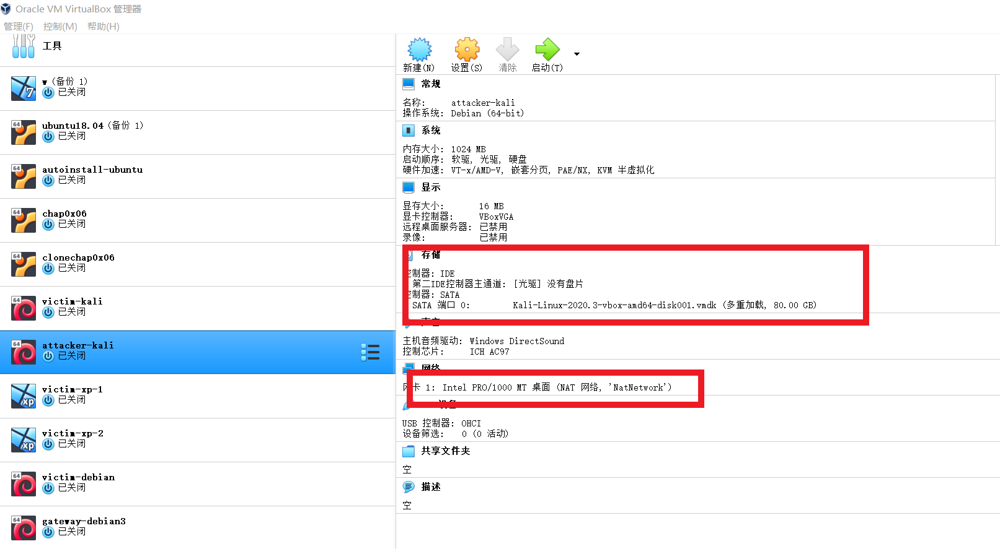
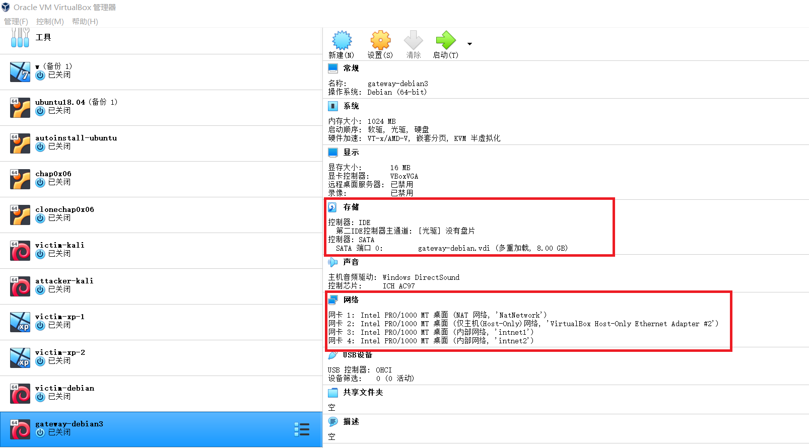
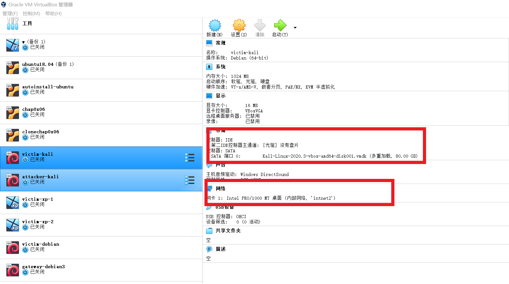
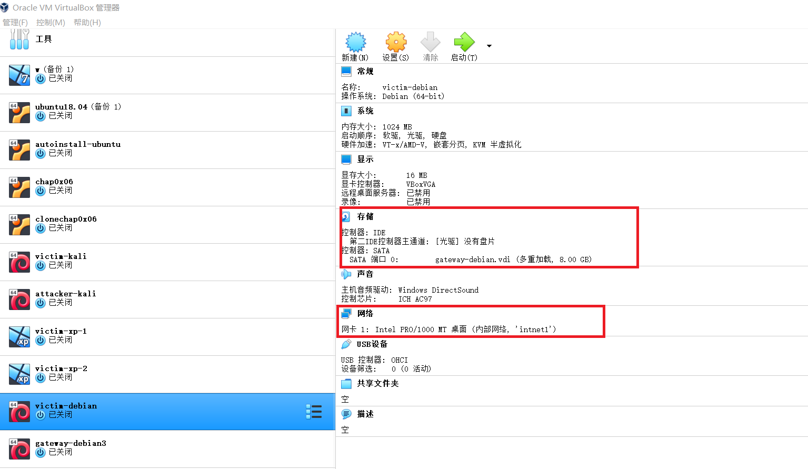
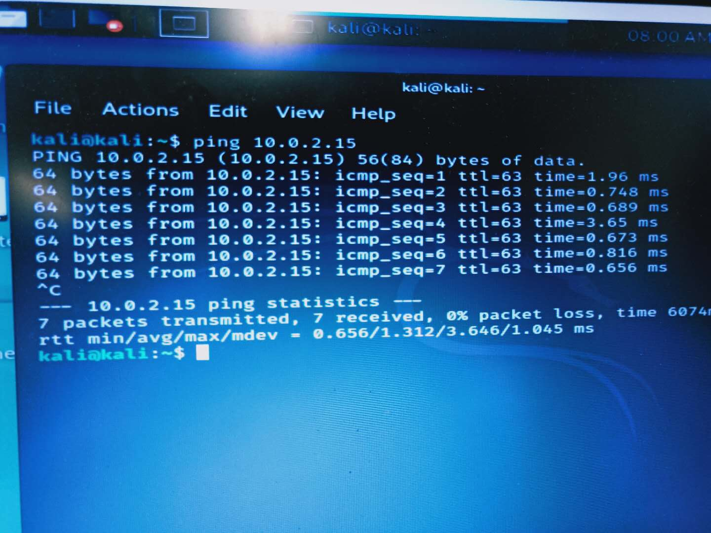
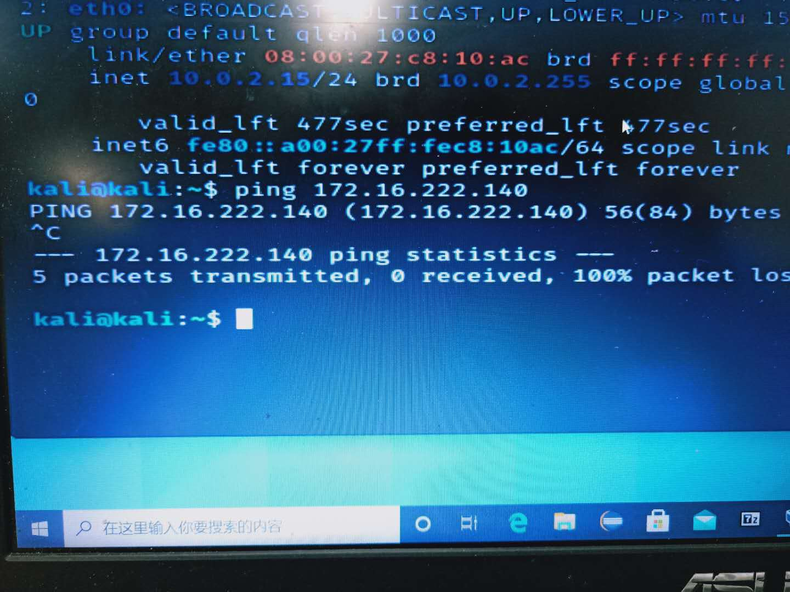
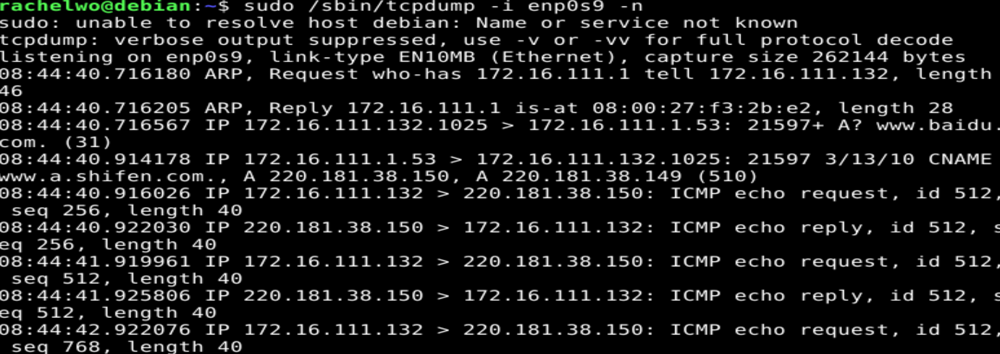
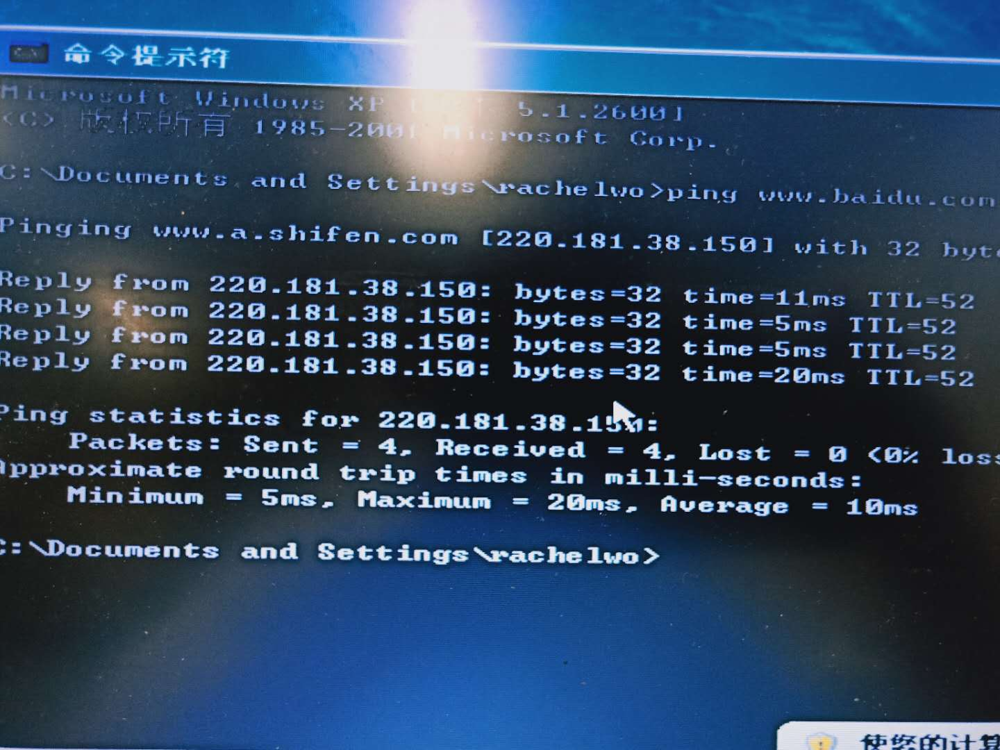
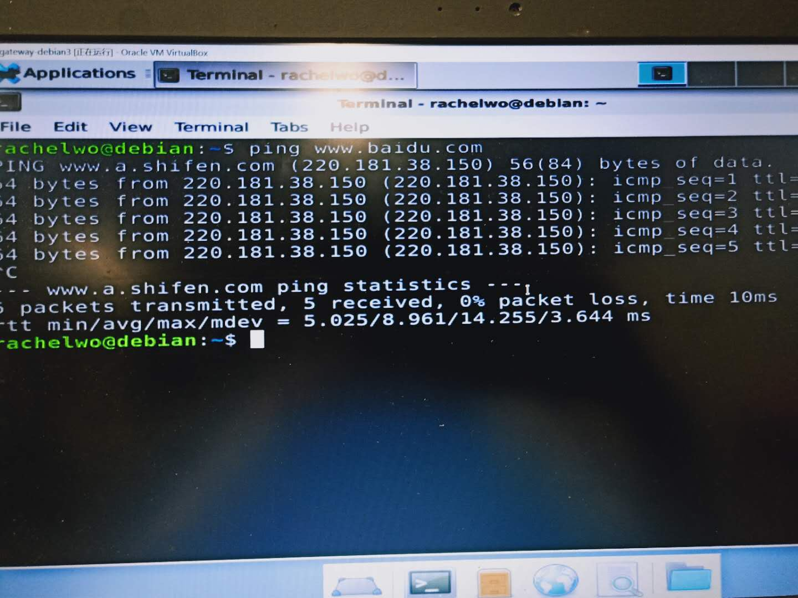
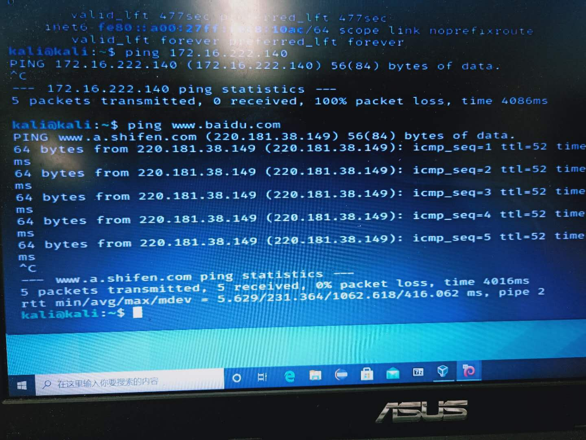

# CHAP0X01 基于virtual box的网络攻防基础环境搭建  
## **实验环境**  
* 一台debian的网关：    
  * gateway-debian3
* 在内部网络intnet1内：  
    * 一台Windows XP系统的靶机：victim-xp1  
    * 一台debian系统的靶机:  victim-debian  
* 在内部网络intnet2内：  
    * 一台Windows XP系统的靶机：victim-xp2  
    * 一台kali系统的靶机:victim-kali
* 一台攻击者主机：  
    * attacker-kali  
## **实验过程**  
  * **配置虚拟机**   
   
       
  * 网卡配置：将网卡1配置成NAT网络（之前选用的是NAT，老师说所有选NAT的网卡分配的ip地址都是10.0.2.15，不能互相ping通，不满足本实验要求的网关可以ping通所有主机，所以选NAT网络）
       
  

      
* 网卡配置：  
    * 网卡1：NAT网络（理由同上）  
    * 网卡2：Host-only网络（连putty方便操作）  
    * 网卡3：intnet1(跟debian和XP1一个局域网)
    * 网卡4：intnet2（跟kali和XP2一个局域网）  

  
* 网卡配置： 内部网络intnet2(Windows XP2跟这个配置一样，就不赘述了)   
  
   
* 网卡配置：内部网络intnet1(配置网卡的时候点开高级选项，选PCent-FAST Ⅲ，如果是默认选项，XP的驱动不支持，所以选这个)    

  
  * 网卡配置：内部网络intnet1    

* **配置网络**  
* gateway-debian3:  
    * 配置 /etc/network/interfaces 文件  
    ```  
    # /etc/network/interfaces
    # This file describes the network interfaces available on your system
    # and how to activate them. For more information, see interfaces(5).

    source /etc/network/interfaces.d/*  

    # The loopback network interface  
    auto lo
    iface lo inet loopback

    # The primary network interface  
    allow-hotplug enp0s3  
    iface enp0s3 inet dhcp  
    post-up iptables -t nat -A POSTROUTING -s 172.16.111.0/24 ! -d 172.16.0.0/16 -o enp0s3 -j MASQUERADE  
    post-up iptables -t nat -A POSTROUTING -s 172.16.222.0/24 ! -d 172.16.0.0/16 -o enp0s3 -j MASQUERADE  

    # demo for DNAT  
    post-up iptables -t nat -A PREROUTING -p tcp -d 192.168.56.113 --dport 80 -j DNAT --to-destination 172.16.111.118  
    post-up iptables -A FORWARD -p tcp -d '172.16.111.118' --dport 80 -j ACCEPT  
    
    post-up iptables -P FORWARD DROP  
    post-up iptables -A FORWARD -m state --state RELATED,ESTABLISHED -j ACCEPT  
    post-up iptables -A FORWARD -s '172.16.111.0/24' ! -d '172.16.0.0/16' -j ACCEPT  
    post-up iptables -A FORWARD -s '172.16.222.0/24' ! -d '172.16.0.0/16' -j ACCEPT  
    post-up iptables -I INPUT -s 172.16.111.0/24 -d 172.16.222.0/24 -j DROP  
    post-up iptables -I INPUT -s 172.16.222.0/24 -d 172.16.111.0/24 -j DROP  
    post-up echo 1 > /proc/sys/net/ipv4/ip_forward  
    post-down echo 0 > /proc/sys/net/ipv4/ip_forward  
    post-down iptables -t nat -F  
    post-down iptables -F  
    allow-hotplug enp0s8  
    iface enp0s8 inet dhcp  
    allow-hotplug enp0s9  
    iface enp0s9 inet static  
    address 172.16.111.1  
    netmask 255.255.255.0  
    allow-hotplug enp0s10  
    iface enp0s10 inet static  
    address 172.16.222.1  
    netmask 255.255.255.0   
  ```   
  修改完配置文件之后重启网卡，使用```/sbin/ifup 网卡名称```命令   
  效果：  
     
    * 安装dnsmasq，为网关配置dhcp和dns服务  
    ```  
        apt-get update  
        apt-get install dnsmasq  
    ``` 
    修改dnsmasq配置文件，养成改前先备份的良好习惯  
    ```  diff dnsmasq.conf dnsmasq.conf.bak```  
    ```  
    661,662c661
    < log-queries
    < log-facility=/var/log/dnsmasq.log
    ---
    > #log-queries
    665c664
    < log-dhcp
    ---
    > #log-dhcp  
    ```
    启动dnsmasq服务，如下图：  
    
    * 查看各个靶机是否获得ip地址  
        * victim-kali 172.16.222.140 
          
        * victim-XP2 172.16.222.122  
          
        * victim-XP1  172.16.111.132
          
        * victim-debian  172.16.111.141
        
    

* **测试网络连通性** （有段时间电脑太卡，所以直接上手机拍了） 
    - [x] 靶机可以直接访问攻击者主机（每个局域网选一台机器）  
      * intnet1内的victim-XP1
       
      * intnet2内的victim-kali
      
    - [x] 攻击者主机无法直接访问靶机（每个局域网选一台机器）  
      * intnet1内的victim-XP1
      
      *  intnet2内的victim-kali 
      
    - [x] 网关可以直接访问攻击者主机和靶机   
      * 访问intnet2内的victim-kali  

         
      * 访问intnet1内的victim-XP1  

        
      * 访问攻击者主机attacker-kali  

        
    - [x] 靶机的所有对外上下行流量必须经过网关  
      * enp0s10的流量   

        
      * enp0s9的流量    

      
    - [x] 所有节点均可以访问互联网
    * victim-debian  

      
    * victim-kali  

      
    * victim-XP1  
      
    * victim-XP2 

       
    * gateway-debian3 

       
    * attacker-kali  
    
    
* **问题及解决方式**  
  * 安装debian启动后黑屏  
    * 解决：Debian Buster安装完成前设置GRUB安装位置为/dev/sda  
  * gateway-debian3执行``` apt-get update```指令失败（排除权限问题）  
    * 描述：当时报错是要插入源（忘记把报错信息截图保存下来了） 
    *  解决：  
    ```  
    sudo vi /etc/apt/sources.list  #打开apt源文件  

    deb http://http.us.debian.org/debian/ stable main #加入这行代码
    ```
  * debian主机能执行``` apt-get update``` 了，但是又安装不了vim  
    * 解决：  
    ```  
    apt-get remove vim-common  #卸载这个依赖包就好啦
    ```
  * 测试网络连通性时，同一局域网内，victim-debian不能ping通victim-XP1,但victim-XP1能ping通victim-debian  
    * 解决：还以为是网络配置的问题，后来突然想起没有关Windows XP主机的防火墙。。。（我真傻，真的）  
  * 所有kali主机启动一次后就不能正常启动了,重装后也是相同结果  
    * 描述：上网查是显卡驱动的问题，进行如下操作：  
        
    没有效果，听从老师的建议更新vbox版本后成功解决。  
* **参考资料**   
  * 老师对同学疑问的解答  
  * [debian无法安装vim问题解决](https://blog.csdn.net/weixin_39417086/article/details/91504111)    
  * [debian无法使用apt-get update问题解决](https://blog.csdn.net/jiaqi_327/article/details/21610397)


  
  