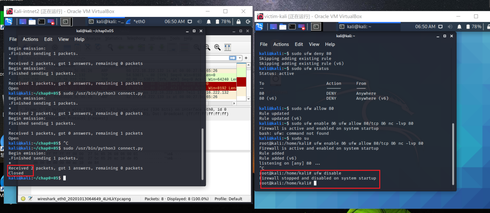
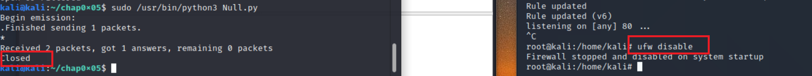

# **chap0x05 基于Scapy编写端口扫描器**  
  
## 实验要求   
 
-  禁止探测互联网上的 IP ，严格遵守网络安全相关法律法规  
-  完成以下扫描技术的编程实现
    * TCP connect scan / TCP stealth scan  
    * TCP Xmas scan / TCP fin scan / TCP  null scan  
    * UDP scan  
-  上述每种扫描技术的实现测试均需要测试端口状态为：开放、关闭 和 过滤 状态时的程序执行结果  
-  提供每一次扫描测试的抓包结果并分析与课本中的扫描方法原理是否相符？如果不同，试分析原因；  
-  在实验报告中详细说明实验网络环境拓扑、被测试 IP 的端口状态是如何模拟的
- 可选）复刻 nmap 的上述扫描技术实现的命令行参数开关  

## 实验环境
* 网络拓扑图  
  
  * kali-intnet2:172.16.222.133  
  * victim-kali:172.16.222.132  
* 攻击者配置  
    * python + scapy   
## 实验过程  
* TCP connect scan  
    * 相关知识：  
        使用最基本的 TCP 三次握手链接建立机制，建立一个链接到目标主机的特定端口上。首先发送一个 SYN 数据包到目标主机的特定端口上，如果接收到的是一个 SYN/ACK 数据包，则说明端口是开放状态的；如果接收到的是一个 RST/ACK 数据包，通常意味着端口是关闭的并且链接将会被重置；而如果目标主机没有任何响应则意味着目标主机的端口处于过滤状态。  
    * 代码：  
    ```  
    #! /usr/bin/python

    import logging
    logging.getLogger("scapy.runtime").setLevel(logging.ERROR)
    from scapy.all import *

    dst_ip = "172.16.222.132"
    src_port = RandShort()
    st_port = 80

    tcp_connect_scan_resp = sr1(IP(dst=dst_ip)/TCP(sport=src_port,dport=dst_port,flags="S"),timeout=10)
    if tcp_connect_scan_resp is None:
        print ("Filtered")
    elif(tcp_connect_scan_resp.haslayer(TCP)):
        if(tcp_connect_scan_resp.getlayer(TCP).flags == 0x12): 
            send_rst = sr(IP(dst=dst_ip)/TCP(sport=src_port,dport=dst_port,flags="AR"),timeout=10)
            print ("Open")
        elif (tcp_connect_scan_resp.getlayer(TCP).flags == 0x14):   
            print ("Closed")  
    ```  
    * 靶机模拟80端口开放状态：  
     ``` ufw enable && ufw allow 80 && nc -lvp 80```   
           
          
    * nmap复刻  
          
    * 靶机模拟80端口过滤状态：  
    ``` ufw enable && ufw deny 80```  
    
    
    * nmap复刻  
      
    * 靶机模拟80端口关闭状态  
    ``` ufw disable```  
      
      
    * nmap复刻  
      
* TCP stealth scan  
    * 相关知识：  
    TCP SYN 扫描并不需要打开一个完整的链接。发送一个 SYN 包启动三方握手链接机制，并等待响应。如果我们接收到一个 SYN/ACK 包表示目标端口是开放的；如果接收到一个 RST/ACK 包表明目标端口是关闭的；如果端口是被过滤的状态则没有响应。当得到的是一个 SYN/ACK 包时通过发送一个 RST 包立即拆除连接。  
    * 代码：  
    ```  
    #! /usr/bin/python

    import logging
    logging.getLogger("scapy.runtime").setLevel(logging.ERROR)
    from scapy.all import *

    dst_ip = "172.16.222.132"
    src_port = RandShort()
    dst_port = 80

    stealth_scan_resp = sr1(IP(dst=dst_ip)/TCP(sport=src_port,dport=dst_port,flags="S"),timeout=10)
    if stealth_scan_resp is None:
        print ("Filtered")
    elif(stealth_scan_resp.haslayer(TCP)):
        if(stealth_scan_resp.getlayer(TCP).flags == 0x12):
            send_rst = sr(IP(dst=dst_ip)/TCP(sport=src_port,dport=dst_port,flags="R"),timeout=10)
            print ("Open")
        elif (stealth_scan_resp.getlayer(TCP).flags == 0x14):
            print ("Closed")  
    ```  
    端口状态的模拟同上  
    * 80端口开放状态：  
    
    
    * nmap复刻  
      
    * 80端口过滤状态：  
    
    
    * nmap复刻  
      
    * 80端口关闭状态：  
    
      
    * nmap复刻  
      
* TCP Xmas scan   
    * 相关知识  
    Xmas 发送一个 TCP 包，并对 TCP 报文头 FIN、URG 和 PUSH 标记进行设置。若是关闭的端口则响应 RST 报文；开放或过滤状态下的端口则无任何响应。  
    * 代码：  
    ```  
    #! /usr/bin/python

    import logging
    logging.getLogger("scapy.runtime").setLevel(logging.ERROR)
    from scapy.all import *

    dst_ip = "172.16.222.132"
    src_port = RandShort()
    dst_port = 80

    xmas_scan_resp = sr1(IP(dst=dst_ip)/TCP(dport=dst_port,flags="FPU"),timeout=10)  
    if xmas_scan_resp is None:
        print ("Open|Filtered")
    elif(xmas_scan_resp.haslayer(TCP)):
        if(xmas_scan_resp.getlayer(TCP).flags == 0x14):
            print ("Closed")  
    ```  
    端口状态的模拟同上  
    * 80端口开放状态  
    
    
    * nmap复刻  
       
     * 80端口过滤状态  
    
    
    * nmap复刻  
       
     * 80端口关闭状态  
    
    
    * nmap复刻  
      
* TCP FIN scan   
    * 相关知识：    
     仅发送 FIN 包，它可以直接通过防火墙，如果端口是关闭的就会回复一个 RST 包，如果端口是开放或过滤状态则对 FIN 包没有任何响应。  
     * 代码：  
     ```  
     #! /usr/bin/python

    import logging
    logging.getLogger("scapy.runtime").setLevel(logging.ERROR)
    from scapy.all import *

    dst_ip = "172.16.222.132"
    src_port = RandShort()
    dst_port = 80

    fin_scan_resp = sr1(IP(dst=dst_ip)/TCP(dport=dst_port,flags="F"),timeout=10)
    if fin_scan_resp is None:
        print ("Open|Filtered")
    elif(fin_scan_resp.haslayer(TCP)):
        if(fin_scan_resp.getlayer(TCP).flags == 0x14):
            print ("Closed")    
    ```  
    端口状态的模拟同上  
    * 80端口开放状态  
    
    
    * nmap复刻  
    
      * 80端口过滤状态  
    
    
    * nmap复刻  
      
    * 80端口关闭状态  
    
    
    * nmap复刻  
      
* TCP Null scan  
    * 相关知识：  
    发送一个 TCP 数据包，关闭所有 TCP 报文头标记。只有关闭的端口会发送 RST 响应。  
    * 代码：  
    ```  
    #! /usr/bin/python

    import logging
    logging.getLogger("scapy.runtime").setLevel(logging.ERROR)
    from scapy.all import *

    dst_ip = "172.16.222.132"  
    src_port = RandShort()  
    dst_port = 80

    null_scan_resp = sr1(IP(dst=dst_ip)/TCP(dport=dst_port,flags=""),timeout=10)
    if null_scan_resp is None:  
        print ("Open|Filtered")
    elif(null_scan_resp.haslayer(TCP)):  
        if(null_scan_resp.getlayer(TCP).flags == 0x14):  
            print ("Closed")
    ```  
    端口状态的模拟同上  
    * 80端口开放状态  
    
    
    * nmap复刻  
    
     * 80端口过滤状态  
    
    
    * nmap复刻  
      
     * 80端口关闭状态  
    
    
    * nmap复刻  
      
* UDP scan  
    * 相关知识  
    当向一个未开放的 UDP 端口发送数据时,其主机就会返回一个 ICMP 不可到达(ICMP_PORT_UNREACHABLE)的错误，因此大多数 UDP 端口扫描的方法就是向各个被扫描的 UDP 端口发送零字节的 UDP 数据包，如果收到一个 ICMP 不可到达的回应，那么则认为这个端口是关闭的,对于没有回应的端口则认为是开放的，但是如果目标主机安装有防火墙或其它可以过滤数据包的软硬件,那我们发出 UDP 数据包后,将可能得不到任何回应,我们将会见到所有的被扫描端口都是开放的。  
    * 代码：  
    ```  
    ! /usr/bin/python

    import logging

    logging.getLogger("scapy.runtime").setLevel(logging.ERROR)

    from scapy.all import *


    dst_ip = "172.16.222.132" 

    src_port = RandShort()

    dst_port = 53

    dst_timeout = 10


    udp_scan_resp = sr1(IP(dst=dst_ip)/UDP(dport=dst_port),timeout=dst_timeout)

    if udp_scan_resp is None:

    print ("Open or Filtered")

    elif(udp_scan_resp.haslayer(ICMP)):

    if(int(udp_scan_resp.getlayer(ICMP).type)==3 and int(udp_scan_resp.getlayer(ICMP).code)==3):

        print ("Closed")
    ```
  * 53端口开放状态   
    ```  
    systemctl restart dnsmasq  
    ufw enable && ufw allow 53  
    ```  
    (dnsamsq服务占用53端口，开启dnsmasq,53端口也会开启)   
    
    
  * nmap复刻  
      
  * 53端口过滤状态   
     ``` ufw enable && ufw deny 53``` 
    
    
  * nmap复刻  
        
  * 53端口关闭状态  
     ``` 
     systemctl stop dnsmasq   
     ufw disable  
     ``` 

    
    
  * nmap复刻  
      
* 每一次扫描测试的抓包结果与课本中的扫描方法原理基本相符  
## 问题与解决  
* 无法打开UDP端口，经查阅资料：端口不是孤立的，应启动占用这个端口的服务以开启端口。dnsmasq服务是占用53端口的，所以安装并打开dnsmasq。
```  
apt-get update  
apt install dnsmasq  
sysytemctl start dnsmasq
sysytemctl status dnsmasq # 查看此服务状态，active即成功开启  
``` 
## 参考资料  
* [网络安全课本](https://c4pr1c3.github.io/cuc-ns/chap0x05/main.html)  
* [2019-NS-Public-hejueyun](https://github.com/CUCCS/2019-NS-Public-hejueyun/blob/chap0x05/chap0x05/README.md)  
* [scapy编程实现端口扫描](https://blog.csdn.net/think_ycx/article/details/50917715?utm_medium=distribute.pc_relevant.none-task-blog-title-2&spm=1001.2101.3001.4242)  
* 课程群中关于如何打开UDP端口的讨论  
* [netcat命令参数详解](http://www.linuxso.com/command/nc.html)
 


       
    
