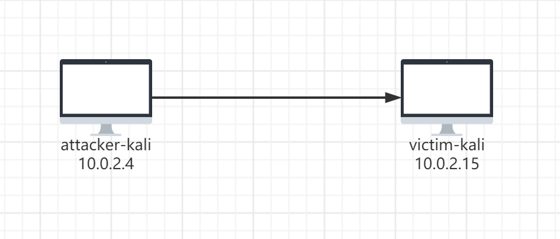
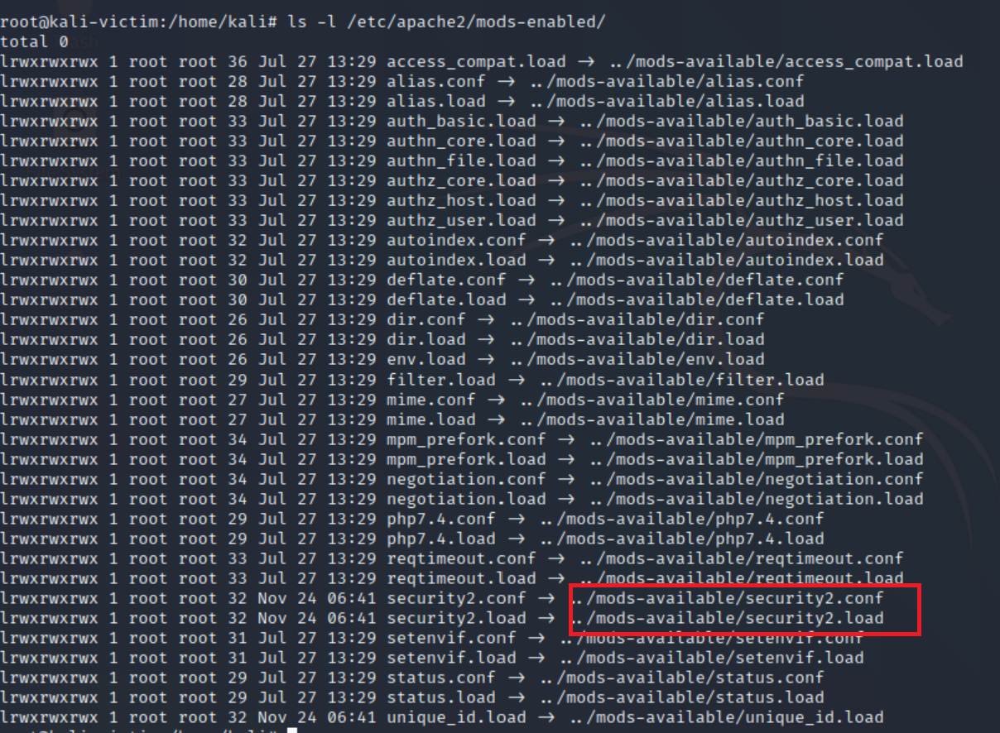
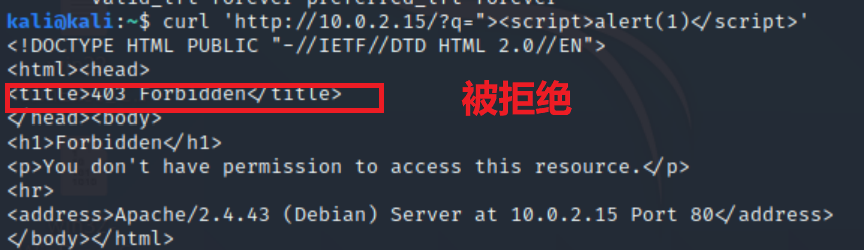
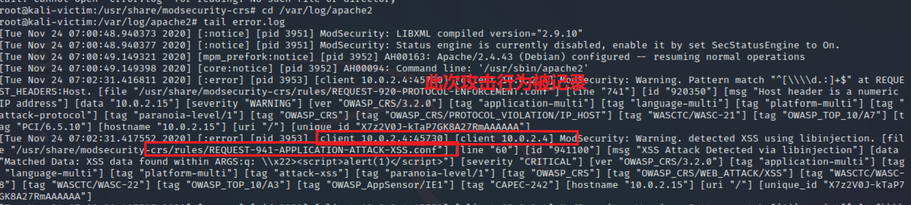
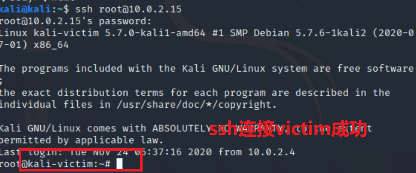
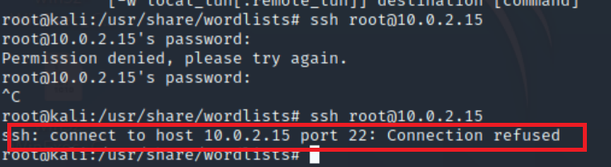
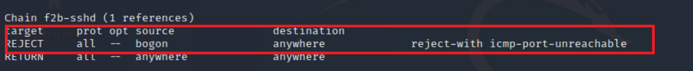
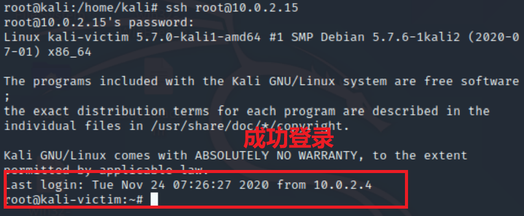
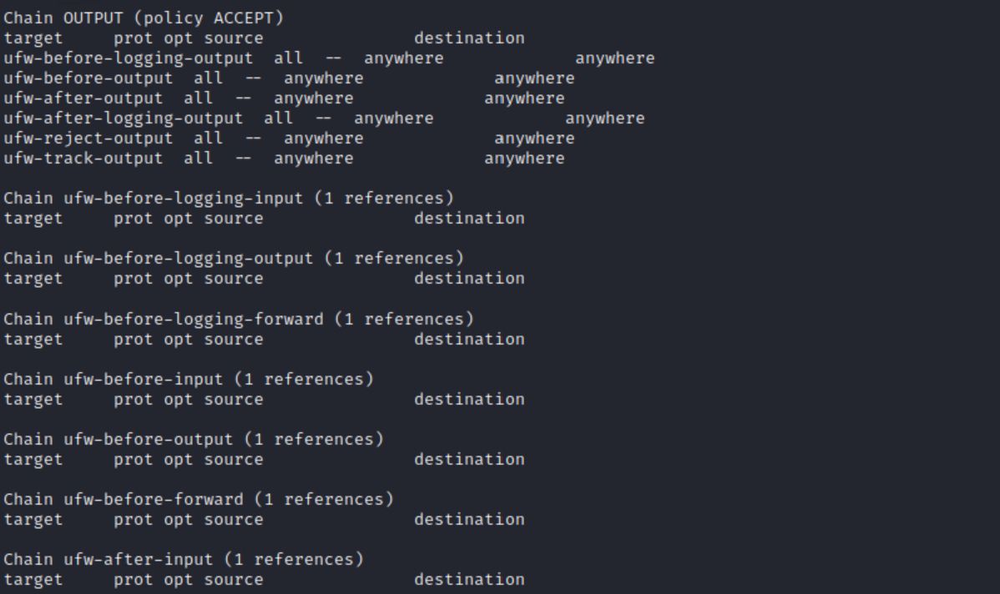

# 应用程序安全加固  
## 网络拓扑结构  
  
## 实验过程  
**Apache 内置安全措施**  
```  
ls -l /etc/apache2/mods-enabled/ #查看可用模块

# 搜索security软件包
apt search apache | grep security  
apt update &&apt-get install libapache2-mod-security2  #更新软件包并且安装相关模块
```  
  
* 配置规则  
```  
# 备份规则
mv /usr/share/modsecurity-crs /usr/share/modsecurity-crs.bk

# 下载 OWASP ModSecurity Core Rule Set
git clone https://github.com/SpiderLabs/owasp-modsecurity-crs.git /usr/share/modsecurity-crs

# 启用配置文件
cd owasp-modsecurity-crs
mv crs-setup.conf.example crs-setup.conf

# 修改配置
vi /etc/apache2/mods-enabled/security2.conf

# 在文件中添加规则路径
<IfModule security2_module> 
     SecDataDir /var/cache/modsecurity 
     IncludeOptional /etc/modsecurity/*.conf 
     IncludeOptional /usr/share/modsecurity-crs/*.conf 
     IncludeOptional /usr/share/modsecurity-crs/rules/*.conf 
 </IfModule>

# 启用引擎
vi /etc/modsecurity/modsecurity.conf

# 将 DectionOnly 改为 On
SecRuleEngine On

# 重启以生效
systemctl restart apache2  
```  
* 尝试对靶机进行XSS攻击  
  * 攻击者主机这边显示攻击被禁止  
    
  * 靶机这里通过``` tail error.log```查看日志文件，发现攻击者主机的攻击行为被记录下来  
     
 
**fail2ban相关实验**  
* 启用fail2ban之前，尝试使用ssh连接靶机，可以成功连接  
  
* 安装fail2ban后启动  
```  
apt-get install fail2ban  
systemctl enable fail2ban  
systemctl restart fail2ban  
```  
* 配置文件    
* 配置fail2ban对ssh服务的监视
```  
vim  /etc/fail2ban/jail.local #首先打开配置文件
在文件中添加以下内容
[sshd]
enabled = true
banaction = iptables-multiport

sudo systemctl enable fail2ban  #打开fail2ban 
sudo systemctl restart fail2ban  #重启fail2ban服务   
```  
* 尝试在ssh连接靶机的时候输入错误的密码  
    
发现输入一次错误密码之后尝试第二次连接被拒绝,查看靶机的iptables规则，发现多了一条拒绝本机ssh连接的规则 
  
等阻止事件过去后再次尝试连接靶机，成功  
   
查看靶机的iptables规则，发现已经没有了拒绝攻击者主机进行ssh连接的那条规则  
  
## 课后思考题  
* 试举⼀例说明“人的安全意识和安全能力在应用程序安全加固中是不可忽视的重要环节”。 
> 比如老师上课讲的 Nday漏洞，用户不经常更新应用程序，即使软件开发方在新发布的版本里已经为之前的漏洞打上了补丁，但用户不使用新版本导致最后还是不能达成安全加固的目的。  

> 用户设置弱口令，很容易就能被爆破。
### 参考资料  
[实战fail2ban防止Basic认证暴力破解和SSH口令爆破](https://blog.csdn.net/jackcily/article/details/85149769)  
[师姐的作业](https://github.com/CUCCS/2019-NS-Public-chencwx/tree/ns_chap0x10/ns_chapter10)  
[老师的课本](https://c4pr1c3.github.io/cuc-ns/)
